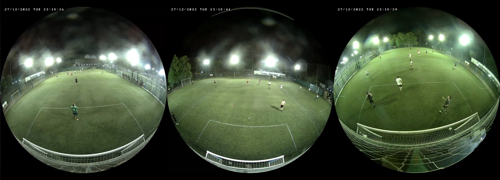

# Beelup video downloader

### [Beelup](https://www.beelup.com/) es un sitio que graba canchas de distintos deportes con una o multilpes camaras. Lamentablemente no ofrece una forma comoda de descargar el partido entero en un formato amigable.

### Este script permite automatizar la descarga y la composición de la grabación en un solo archivo


#### Camara Unica


#### Camara Doble


#### Camara Triple


## Requisitos:

Tener bajado la version más reciente de [ffmpeg](https://ffmpeg.org/download.html)

## Como usar:

Clonar repositorio:
```
git clone https://github.com/matiasba/beelup_video_downloader.git
cd beelup_video_downloader
```
Crear virtualenv
```
python3 -m venv venv
```
Activar virtualenv
```
source venv/bin/activate
```
Instalar dependencias
```
pip install -r requirements.txt
```
Editar `beelupDownloader.py`

Modificar variable `ffmpeg` para apuntar al binario de tu version de ffmpeg

Modificar variable `id_link` para apuntar a un link valido previamente pagado de [Beelup](https://www.beelup.com/)

(Opcional) Modificar `series_name`, se usa para generar el nombre del archivo que ya viene pre-formateado para ser reconocido como una serie por varios media centers como Plex y Jellyfin

Iniciar `beelupDownloader.py`
```
python3 beelupDownloader.py
```
Tener en cuenta que para videos con doble o triple camara el proceso puede llevar más de 30m (dependiendo de tu cpu), ya que es necesario re-encodear el video.
